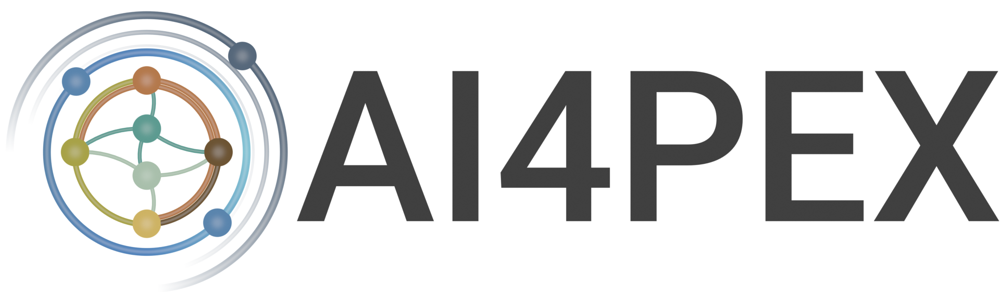

# Browzarr
A browser-based visualization toolkit for exploring and analyzing Zarr data stores.

> [!IMPORTANT]
> Visit at [browzarr.io](https://browzarr.io)

Stay tuned for updates! 🚀

> [!TIP]
> _Have a suggestion or a feature request? Don't hesitate to open an issue or PR!_

## Acknowledgments & Funding

<table style="border-collapse: collapse; border: none; white-space: nowrap;">
<tr>
<td style="text-align: center; border: none;"></td>
<td style="text-align: center; border: none;"></td>
<td style="text-align: center; border: none;"><a href="http://seasfire.hua.gr/" target="_blank"></td>
<td style="text-align: center; border: none;"><a href="https://ai4pex.org" target="_blank"></td>
</tr>
</table>

- This project has received funding from the European Union's Horizon Europe research and innovation programme under grant agreement no. 101137682 (AI4PEX – Artificial Intelligence and Machine Learning for Enhanced Representation of Processes and Extremes in Earth System Models).

- This work has been funded by the European Space Agency (ESA) SeasFire project under the [ESA Future EO-1 Science for Society Call](https://eo4society.esa.int/projects/seasfire/), supported by ESA’s Network of Resources Initiative.

_Funded by the European Union. The views expressed are those of the authors and do not necessarily reflect those of the European Union, the European Research Executive Agency or the European Space Agency. Neither granting authority can be held responsible for them._